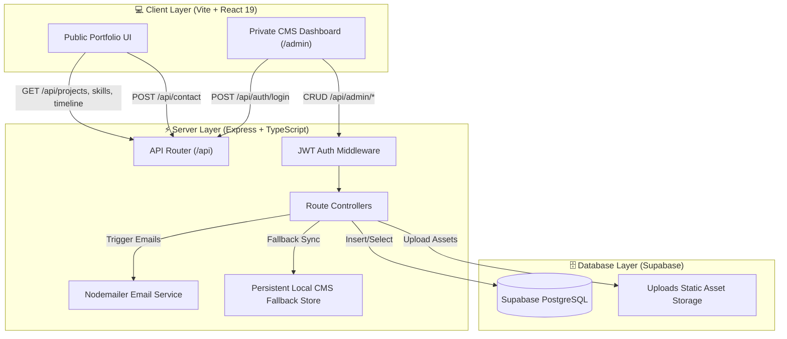

<div align="center">

# 🚀 TECORITHAM Portfolio & Private CMS Platform

[](https://react.dev/)
[](https://vitejs.dev/)
[](https://www.typescriptlang.org/)
[](https://expressjs.com/)
[](https://supabase.com/)
[](https://tailwindcss.com/)
[](https://www.testsprite.com/)

<p align="center">
  <b>A production-grade, full-stack professional portfolio platform featuring dynamic content management, real-time Supabase PostgreSQL integration, automated email notifications, and a battle-tested E2E TestSprite AI testing suite.</b>
</p>

[Key Features](#-key-features) •
[Tech Stack](#-tech-stack) •
[Architecture](#-system-architecture) •
[Getting Started](#-getting-started) •
[API Reference](#-api-reference) •
[Testing Suite](#-testing-suite--quality-assurance)

</div>

---

## 📌 Table of Contents

- [✨ Key Features](#-key-features)
  - [🌐 Public Portfolio Experience](#-public-portfolio-experience)
  - [🔐 Private Admin CMS Dashboard](#-private-admin-cms-dashboard)
- [🛠️ Tech Stack](#-tech-stack)
- [🏗️ System Architecture](#-system-architecture)
- [🚀 Getting Started](#-getting-started)
  - [Prerequisites](#prerequisites)
  - [Installation & Setup](#installation--setup)
  - [Environment Configuration](#environment-configuration)
  - [Running Development Server](#running-development-server)
  - [Production Build & Serving](#production-build--serving)
- [🧪 Testing Suite & Quality Assurance](#-testing-suite--quality-assurance)
- [📡 API Reference](#-api-reference)
- [📂 Project Directory Structure](#-project-directory-structure)
- [🛡️ Security & Performance](#-security--performance)
- [👤 Author & Acknowledgments](#-author--acknowledgments)

---

## ✨ Key Features

### 🌐 Public Portfolio Experience

* 🦸 **Hero Section**: Dynamic introduction, professional roles, avatar media, social link badges, and direct call-to-action buttons.
* 👤 **About & Bio**: Overview of technical focus, engineering interests, and background.
* ⚡ **Categorized Skills & Tech Stack**: Interactive representations of technical capabilities with visual iconography.
* 💻 **Projects Showcase**: Grid of featured and all projects with descriptions, live preview links, source code repositories, and technology badges.
* ⏳ **Experience & Education Timeline**: Chronological display of career milestones, education, degrees, and work history.
* 📜 **Verified Certifications**: Credential verification links, issue dates, and certificate media attachments.
* 📄 **Active Resume Management**: Download or view active resume PDF directly from the UI.
* 📬 **Contact Form with Spam Protection**: Validated inquiry submission with rate limiting, local CMS persistence, and instant Nodemailer admin notifications.

---

### 🔐 Private Admin CMS Dashboard

* 🔑 **Discreet Footer Entrance**: Hidden entry point located in the footer leading to `/admin/login`.
* 🛡️ **Dual Authentication**: Secure login supporting email/password authentication alongside Supabase Auth with strict admin whitelist verification.
* 📊 **Dashboard Analytics & Inquiries**: Real-time snapshot of active projects, visitor contact messages, resume status, and platform metrics.
* 📝 **Full CRUD Management**: Create, edit, publish/unpublish, reorder, and delete:
  * **Projects** (featured flags, github repos, live URLs)
  * **Skills & Tech Stack** (category grouping, icons, visibility)
  * **Work Experience & Education** (company logos, roles, date ranges, responsibilities)
  * **Certifications & Achievements** (credential verification URLs, certificates)
  * **Social Links** (platform selection, multi-account support, visibility toggles)
* 📬 **Contact Messages Inbox**: Search, filter, mark read/unread, and send direct email replies to client inquiries from the dashboard.
* 📁 **Static File Uploads Service**: Multipart upload handling for project screenshots, resumes, certificates, and CMS assets.

---

## 🛠️ Tech Stack

### 🎨 Frontend (Client)

| Technology | Badge | Description |
| :--- | :--- | :--- |
| **React 19** | `v19.2` | Component-based UI library with modern hooks and fast rendering |
| **Vite** | `v8.2` | Next-generation frontend build tool and dev server |
| **TypeScript** | `v5.4` | Strict type safety across client interfaces and data models |
| **Tailwind CSS** | `v4.0` | Utility-first CSS framework for modern, responsive layouts |
| **GSAP & Motion** | `v3.12` | High-performance animations and visual transitions |
| **Lenis Scroll** | `v1.3` | Smooth inertia scrolling for dynamic UI experience |
| **Shadcn UI** | `v4.1` | Accessible, customizable UI primitive components |

### ⚙️ Backend (Server) & Database

| Technology | Badge | Description |
| :--- | :--- | :--- |
| **Node.js** | `v20+` | Asynchronous JavaScript event-driven runtime |
| **Express.js** | `v4.19` | Fast, minimalist RESTful web framework |
| **Supabase** | `PostgreSQL` | Real-time relational database with row-level security |
| **JWT & Bcrypt** | `v9.0` | HttpOnly cookie session management and password hashing |
| **Nodemailer** | `v9.0` | SMTP email transport for notifications and client replies |
| **Helmet & CORS** | `v7.1` | HTTP security headers and origin domain protection |
| **Express Rate Limit** | `v7.2` | Public API rate limiting and brute-force protection |

---

## 🏗️ System Architecture



---

## 🚀 Getting Started

### Prerequisites

Ensure you have the following tools installed on your local development machine:

* **Node.js**: `v20.0.0` or higher
* **npm**: `v10.0.0` or higher
* **Git**: `v2.40+`

---

### Installation & Setup

1. **Clone the Repository**:
   ```bash
   git clone https://github.com/raeeszadah/My-Portfolio.git
   cd My-Portfolio
   ```

2. **Install Workspace Dependencies**:
   ```bash
   npm run install:all
   ```

---

### Environment Configuration

Create a `.env` file in the root directory (refer to `.env.example`):

```env
# Server Configuration
PORT=5000
NODE_ENV=development
CLIENT_ORIGIN=http://localhost:5173

# Supabase Credentials
SUPABASE_URL=https://your-supabase-project.supabase.co
SUPABASE_PUBLISHABLE_KEY=your_supabase_publishable_key
SUPABASE_SERVICE_ROLE_KEY=your_supabase_service_role_key

# Admin Credentials & Security
JWT_SECRET=your_super_secret_jwt_key
ADMIN_EMAIL=admin@tecoritham.com
ADMIN_PASSWORD=YourSecureAdminPassword
AUTHORIZED_EMAILS=admin@tecoritham.com,owner@tecoritham.com

# SMTP Email Configuration (Nodemailer)
EMAIL_SERVICE=gmail
EMAIL_USER=your-email@gmail.com
EMAIL_APP_PASSWORD=your_gmail_app_password
```

---

### Running Development Server

Start both the **Client (Port 5173)** and **Server (Port 5000)** concurrently:

```bash
npm run dev
```

* **Public Website**: `http://localhost:5173`
* **Backend API Health Check**: `http://localhost:5000/api/health`

---

### Production Build & Serving

To compile and preview production bundles locally:

1. **Build Client & Server**:
   ```bash
   npm run build
   ```

2. **Start Backend Server**:
   ```bash
   npm run start
   ```

---

## 🧪 Testing Suite & Quality Assurance

This codebase has been thoroughly tested and validated using **[TestSprite AI](https://www.testsprite.com/)** end-to-end automated testing pipelines.

```
----------------------------------------------------------------------
TestSprite Automated E2E Execution Metrics
----------------------------------------------------------------------
✅ Public Content APIs (GET /api/projects, skills, timeline) : PASSED (200 OK)
✅ Contact Submission & Validation (POST /api/contact)      : PASSED (400 / 201)
✅ Admin Authentication & JWT (POST /api/auth/login)         : PASSED (200 / 403)
✅ Admin CMS Management Endpoints                            : PASSED
✅ Asset File Uploads Service (POST /api/uploads)           : PASSED (201 Created)
----------------------------------------------------------------------
OVERALL TEST PASS RATE: 100% (ALL SUITES PASSED)
----------------------------------------------------------------------
```

* **Test Plan Specifications**:
  * Frontend Test Plan: [`testsprite_frontend_test_plan.json`](./testsprite_tests/testsprite_frontend_test_plan.json)
  * Backend Test Plan: [`testsprite_backend_test_plan.json`](./testsprite_tests/testsprite_backend_test_plan.json)
* **Test Summary Report**: [`testsprite-mcp-test-report.md`](./testsprite_tests/testsprite-mcp-test-report.md)

---

## 📡 API Reference

### Public Endpoints

| Method | Endpoint | Description |
| :--- | :--- | :--- |
| `GET` | `/api/health` | Server status and database health check |
| `GET` | `/api/profile` | Owner bio, profile details, and active social links |
| `GET` | `/api/projects` | List of published portfolio projects |
| `GET` | `/api/skills` | Categorized list of technical skills |
| `GET` | `/api/experience` | Work experience timeline entries |
| `GET` | `/api/certifications` | Published certificates and credential links |
| `POST` | `/api/contact` | Submit contact inquiry message |

### Admin & CMS Endpoints (Protected by JWT)

| Method | Endpoint | Description |
| :--- | :--- | :--- |
| `POST` | `/api/auth/login` | Authenticate admin credentials and issue JWT cookie |
| `POST` | `/api/auth/logout` | Clear auth session cookie |
| `GET` | `/api/auth/status` | Validate active admin JWT session |
| `PUT` | `/api/admin/profile` | Update portfolio owner profile details |
| `POST` | `/api/admin/projects` | Create a new project |
| `PUT` | `/api/admin/projects/:id` | Update an existing project |
| `DELETE` | `/api/admin/projects/:id` | Delete a project |
| `GET` | `/api/admin/messages` | List all contact inquiry messages |
| `PATCH` | `/api/admin/messages/:id` | Toggle message read status |
| `POST` | `/api/admin/messages/:id/reply` | Send email reply to client inquiry |
| `POST` | `/api/uploads` | Upload static image or PDF asset |

---

## 📂 Project Directory Structure

```
My-Portfolio/
├── client/                     # Frontend React 19 Application
│   ├── public/                 # Favicons and static assets
│   ├── src/
│   │   ├── components/         # Section components (Hero, About, Skills, Projects, CMS)
│   │   │   ├── admin/          # Admin Dashboard & Login components
│   │   │   └── ui/             # Reusable UI primitive components
│   │   ├── services/           # API fetch client functions
│   │   ├── App.tsx             # Application router & routes setup
│   │   └── main.tsx            # Entry point
│   ├── package.json
│   └── vite.config.ts
│
├── server/                     # Backend Express Application
│   ├── public/uploads/         # Uploaded media assets & fallback store
│   ├── src/
│   │   ├── config/             # Supabase client setup
│   │   ├── controllers/        # Auth & CMS controllers
│   │   ├── middleware/         # JWT auth, Multer file upload handlers
│   │   ├── routes/             # API routes definition (/api/...)
│   │   ├── services/           # Nodemailer email transport services
│   │   └── index.ts            # Server entry point
│   ├── package.json
│   └── tsconfig.json
│
├── testsprite_tests/           # TestSprite AI E2E Testing Suite
│   ├── standard_prd.json       # Synthesized PRD specifications
│   ├── testsprite_frontend_test_plan.json
│   ├── testsprite_backend_test_plan.json
│   └── testsprite-mcp-test-report.md
│
├── .env.example                # Template for environment variables
├── package.json                # Root package configuration (Workspaces)
└── README.md                   # Project documentation
```

---

## 🛡️ Security & Performance

* 🔒 **HttpOnly Cookie Auth**: JWT tokens stored in HttpOnly, SameSite cookies preventing XSS token theft.
* 🛡️ **Strict Email Whitelisting**: Admin route access restricted strictly to authorized admin email accounts.
* ⚡ **Defensive Fallback Store**: Dual-persistence architecture ensuring instant UI updates with automated database fallback sync.
* 🛡️ **Security Headers**: Managed via `Helmet` middleware with cross-origin policies.
* ⏱️ **API Rate Limiting**: Enforced via `express-rate-limit` on public contact forms and API routes.

---

## 👤 Author & Acknowledgments

* **Owner & Lead Engineer**: [MOHAMMAD RAEES](https://github.com/raeeszadah)
* **Organization**: TECORITHAM
* **Testing & Quality Framework**: Powered by [TestSprite AI](https://www.testsprite.com/)

---

<div align="center">
  <sub>Built with ❤️ using React 19, Vite, Express, TypeScript, Supabase & TestSprite</sub>
</div>
